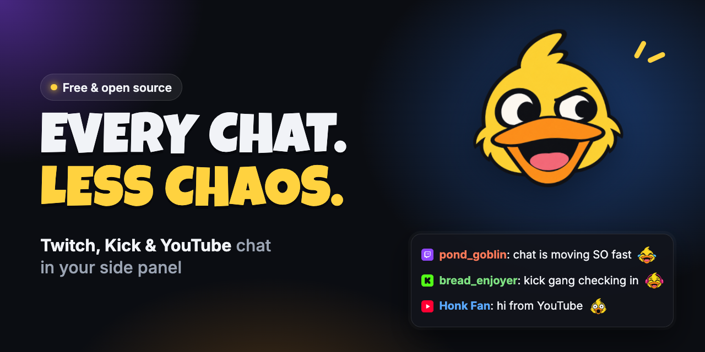

**Twitch, Kick and YouTube live chat, side by side with the stream.**  
A free, open-source Chrome and Brave extension. No account needed, no tracking.

🧩 [Chrome Web Store](https://chromewebstore.google.com/detail/yapp-chat/ocebmcgmildjdidagnnifoegheabnpgd)  ·  🌐 [yapp.chat](https://yapp.chat)  ·  💬 [Discord](https://yapp.chat/discord)  ·  ⭐ [GitHub](https://yapp.chat/github)  ·  🔒 [Privacy](https://yapp.chat/privacy)

---

## ✨ What it does

- 🪟 **Chat in the side panel.** Open a Twitch, Kick or YouTube stream and its chat sits right next to it. Each tab gets its own panel.
- 🌊 **A busy chat you can actually read.** Copypasta folds into one line (`×47`), even when people add invisible characters or stretch their letters to get past Twitch's duplicate check. Turn on *Fold similar messages* and whole reaction waves fold too: "all 3 dead", "ALL 3 DED" and "u got all 3" become one line, `×38 similar`, with every version and who sent it one hover away. In a merged chat it folds across platforms: a simulcast's "W" from Twitch, Kick and YouTube is one line.
- 🧩 **Several chats at once.** Put chats side by side in their own window, or merge a few channels into one chat (even Twitch and YouTube together).
- 😂 **Every emote.** Twitch, 7TV, BetterTTV and FrankerFaceZ emotes, with a picker, favourites and `:` suggestions as you type. Hover one for a big preview.
- 🎨 **Paints and badges.** 7TV name paints and badges show up live, plus BetterTTV and FrankerFaceZ badges.
- 🪪 **User cards.** Click a name to see their account age, followers, earlier names, timeouts and bans, and their chat logs, with search.
- 🔔 **Mentions.** Messages with your name collect in one inbox (your highlight words too, if you like), with a count on the toolbar icon.
- 🧘 **A calmer chat.** Hide bots, `!commands`, people you don't want to read, or messages with certain words. Highlights and hidden words take regexes too, with a small builder to make them.
- ⏸️ **It holds still.** The chat stops scrolling while you hover a name, read a reply or open a card, so nothing jumps away from you.
- 💬 **Follow a conversation.** Click a reply for the whole back-and-forth in one place, emotes and all, and jump to any message in it.
- 🛡️ **Mod tools, on Twitch and Kick.** Delete, time out (your own lengths and reasons) and ban from the message itself, its menu, the user card or a key (D, T, B). Lift a timeout from its line.
  - ⌨️ `/commands` in the message box with suggestions: `/timeout name 10m spam`, `/ban`, `/unban`, `/warn`, `/slow`, `/followers`, `/shield`, `/announce`, `/shoutout`…
  - 👀 See what other mods do: who timed out whom and why, chat mode changes, warnings.
  - 🤖 Twitch: AutoMod's held messages right in the chat, to allow or deny; suspicious users tagged; chat modes and Shield Mode from the header; who's in chat; announcements and shoutouts.
  - 🚨 Twitch: raid protection (followers-only for 10 minutes, Shield Mode or a shoutout in one click) and a tag on first-time chatters with brand-new accounts.
- 📣 **Go-live alerts.** Optional desktop notifications when channels you follow go live: all of them, or just the ones you pick.
- 🌗 **Your look.** Dark or light, compact or comfortable, and your choice of font and emote size.

## 🚀 Install

**From the Chrome Web Store:** [Yapp Chat on the Chrome Web Store](https://chromewebstore.google.com/detail/yapp-chat/ocebmcgmildjdidagnnifoegheabnpgd). One click, and it works in Brave too.

**From this folder (developer mode):**

1. Open `chrome://extensions` (or `brave://extensions`).
2. Turn on **Developer mode** (top right).
3. Click **Load unpacked** and pick this `extension` folder.
4. Open a live stream on Twitch, Kick or YouTube and click the 🦆 in your toolbar.

Needs Chrome 116 or newer, or a Brave based on it.

## 🔑 Signing in (optional)

Reading chat needs no account at all. Sign in only if you want to **send messages** or use **mod tools**:

- 💜 **Twitch:** Settings → Accounts → **Sign in with Twitch**.
- 💚 **Kick:** Settings → Accounts → **Sign in with Kick**.

One click each, and you stay signed in. YouTube chat is read-only.

## 🔒 Privacy

- 🙅 No analytics, no ads, no accounts of our own.
- 💾 Your settings and sign-ins stay in your browser.
- 📡 It only talks to the chat and emote services it needs: Twitch, Kick, YouTube, 7TV, BetterTTV, FrankerFaceZ, a recent-messages service and public chat log servers.

The full policy is at [yapp.chat/privacy](https://yapp.chat/privacy).

## 🗂️ What's in this folder

| File                                             | What it is                                                    |
| ------------------------------------------------ | ------------------------------------------------------------- |
| `manifest.json`                                  | The extension's manifest (Manifest V3)                        |
| `background.js`                                  | Opens the side panel, the mentions count, live notifications  |
| `autoopen.js`                                    | Opens the panel on your first click on a live stream          |
| `sidepanel.*`                                    | The side panel                                                |
| `chat.html`, `chat-window.*`                     | The window with several chats side by side                    |
| `popout.*`                                       | One chat in its own small window                              |
| `options.*`                                      | The Settings page                                             |
| `chat.css`, `sc-theme.css`                       | How the chat looks, light and dark                            |
| `lib/chat.js`                                    | The heart of it: one chat pane, its messages, input and menus |
| `lib/card.js`                                    | The user card                                                 |
| `lib/twitch.js`, `lib/kick.js`, `lib/youtube.js` | Talking to each platform                                      |
| `lib/emotes.js`, `lib/cosmetics.js`              | Emotes, paints and badges                                     |
| `icons/`                                         | The duck 🦆                                                   |

Plain JavaScript modules: no framework, no build step, no dependencies.

## 🛠️ Hacking on it

1. Load the folder as above.
2. Change a file.
3. Hit ↻ on the extension in `chrome://extensions` and reopen the panel.

No build step: the files here are exactly what the browser runs.

## 📜 What's new

Every version's changes are in [CHANGELOG.md](CHANGELOG.md), and at [yapp.chat/changelog](https://yapp.chat/changelog).

## 💬 Help and ideas

Found a bug or have an idea? Open an issue on [GitHub](https://yapp.chat/github) or come say hi in our [Discord](https://yapp.chat/discord). It helps to mention your browser version and the channel or stream link. Pull requests welcome!

## ⭐ Like it?

If Yapp Chat makes your chat a little calmer, give it a star on GitHub. It helps other viewers and streamers find it. 🦆

---

MIT licensed. Not affiliated with Twitch, Kick or YouTube. Made with 🦆 and a lot of yapping.